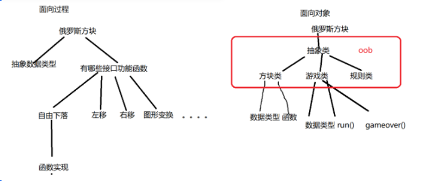

+++
author = "XinYu"
title = "C语言——从C到C++"
date = "2024-3-16"
description = "C++专题之从C到C++篇"
categories = [
    "C++"
]
tags = [
    "C++","从C到C++篇","面向对象"
]

+++


> 1.匹配职位
> 	a.C++开发工程师（在提升）
> 	b.嵌入式QT开发工程师（主要）
> 2.主要内容
> 	a.从c到c++过渡
> 	b.类和对象
> 	c.继承和多态
> 	d.模板(泛型编程)
> 	e.文件io
> 	f.异常处理
> 	g.多线程
> 	h.STL（数据结构与算法）
> 3.学习环境
> 	a.linux
> 	b.编辑器:vim,将来会使用IDE开发环境
> 	c.编译器:g++
> 	d.文件以.cpp后缀

[TOC]


# 一、从C到C++

## 1.头文件

c

```c
#include <stdlib.h>
```

c++

```c++
#include <iostream>
#include <cstdlib>
```

## 2.命名空间

​		a.将变量名(全局)函数名、类型名限制到一个名字空间中
​		b.作用
​				i.缩短名字的作用域，只在命名空间中有效。防止多文件多模块编程时命名冲突
​				ii.例如《流媒体组播》
​						1.媒体库模块
​								a.函数readchn()
​						2.线程池模块
​								a.函数readchn()
​						3.流量控制模块
​						4......
​						5.多模块中函数名字同名了，编译报错了，函数重复定义
​				iii.c++中增加了命名空间
​						1.媒体库模块---->命名空间mlib
​								a.函数readchn()
​						2.线程池模块--->命名空间pthread_pool
​								a.函数readchn()
​						3.流量控制模块
​						4......
​						5.媒体库模央readchn函数在调用的时候: mlib::readchn()
​						6.线程池模块readchn函数在调用的时候: pthread_pool::readchn()
​				iv.c++标准库增加了命名空间，名为std
​				v.c++为c语言也增加了命名空间，在所有的c标准库都改写一份带命名空间的，例如cstdio,cstdlib,cstring
​		c.语法

```
namespace myTestName {
     int a;
     FILE *fp;
     void test(void);        
}//没有分号
```

​		d.打开命名空间
​				i.using namespace myTestName

## 3.读入和输出

cin

```c++
cin >> n;//读入一个整型数，存储到n
scanf("%d",&n);
```

cout

```c++
cout << "hello" << endl;
```

## 4.动态存储空间的开辟

C

```c++
	malloc(3)  calloc()  realloc()  free()
```

C++

```c++
	new 	delete
```

## 5.函数

​		a.默认参数
​				i.在函数的声明中指定，形参列表的最后，可以有多个
​		b.重载
​				i.函数名字相同，参数列表不同，返回值没有要求
​				ii.参数列表不同
​						1.参数的个数不同
​						2.参数的类型不同
​						3.参数的顺序不同

## 6.引用

​		a.变量的别名，指向变量本身
​		b.类似于指针，但是也有不同
​				i.表达，指针是存储地耻的变量，引用是变量本身
​				ii.指针的指向可以改变，引用要从一而终

# 二、面向对象与面向过程

## 1.C语言是面向过程

​		C语言写项目的时候，划分模块，每个模块定义数据类型 + 接口函数，实现对象的函数功能，通过调用函数最终实现项目目标（面向过程）

## 2.C++是典型的面向对象的开发语言

​		实现项目的时候，首先划分模块，然后抽象类，类中有数据类型和函数，通过实例对象

## 3.面向过程和面向对象的区别图

## 4.类的定义

​		a.class定义类别，抽象的
​		b.内容:
​				i.类的成员变量:描述类的属性的
​				ii.类的成员函数:描述类的行为的
​		c.命名规范
​				c
​						1.字母数字下划线组成，数字不开头，区分大小写
​						2.大写: 宏
​						3.连接功能函数: get_name();
​				c++
​						1.字母数字下划线组成，数字不开头，区分大小写
​						2.类名首字母大写，对象名的首字母小写
​						3.驼峰式: getName()

## 5.对象

​		a.实实在在存在的
​		b.实例化对象
​				i.类型名 对象名
​		c.其实对象就是变量