+++
author = "xinyu"
title = "一张图搞懂时序"
date = "2024-03-17"
description = "一张图搞懂时序"
categories = [
    "时序"
]
tags = [
    "时序"
]
image = "2.jpg"

+++

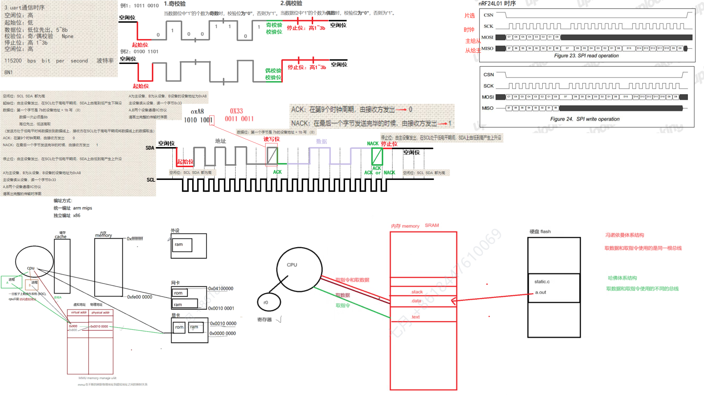

# 三总线

计算机体系结构中根据功能不同，划分出来的三种类型总线，简称三总线

控制总线	数据总线	地址总线

例如：想要往 0xe000e03c 地址中存放 0x100

数据总线传输 0x100	        （数据）

地址总线传输 0xe000e03c  （地址）

控制总线  控制函数时序

# 每个进程都有自己独立的4G内存空间:

物理地址：由cpu sore直接发出到地址总线上，不经过MMU的翻译的地址

虚拟地址：经由MMU的翻译的地址，同一个物理地址对应的虚拟地址可能有多个

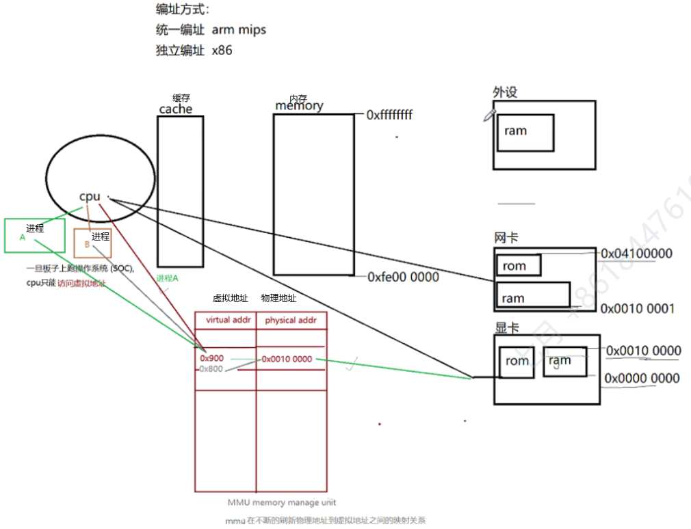

## 位带操作可以使程序员以原子的方式访问内存

原子：最小的，不可再分的

位带区的地址空间 要映射到地址别名区

位带区的1b对应位带别名区的32b，将来访问位带别名区的4个字节，和位带区的某一位内容相同。

# 串口的工作方式

##### 单工		数据只能由一方传向另一方

##### 半双工	数据可以朝两个方向传输，但是同一时刻只能由一方传向另一方

##### 全双工	数据可以同时朝两个方向传输

# 串行通信的协议

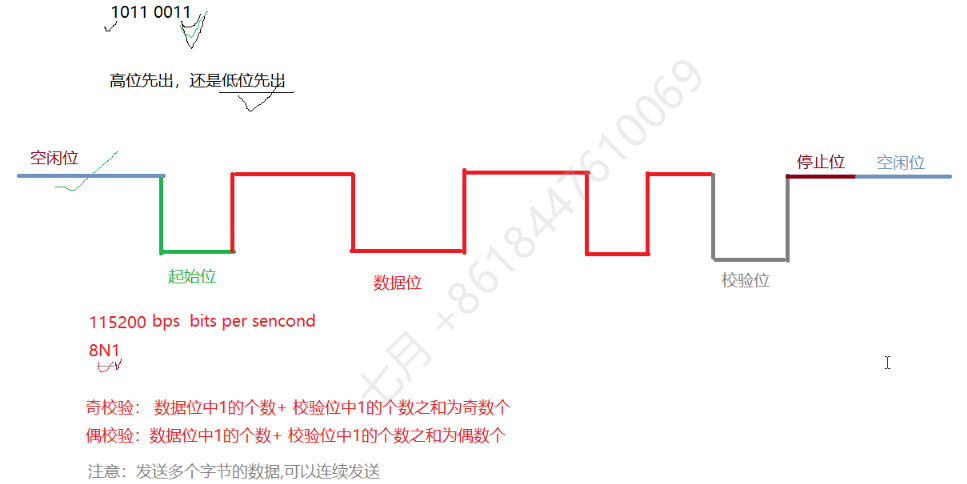

协议：就是一种规定，规则

uart：通用串行异步收发器

通信双方在通信之前必须把所有的规则都定好

低位先出

串行通信的时序：

空闲位	保持高电平

起始位	低电平

数据位	低位先出	一次5~8b

校验位	奇偶校验

停止位	高电平	1~3b

并行通信要求数据线至少有8根，所有硬件互联成本较高

# 例题：

使用串行通信,将0x95数据由A设备发往B设备，采用偶校验的模式，2b停止位，请画出通信的时序图!

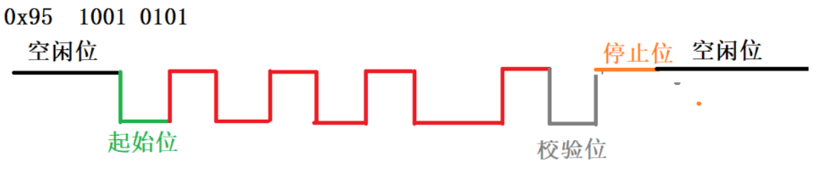

# 串行通信常用的协议

## RS232

电气特性：

逻辑1（-12V ~ -3V）

逻辑0（3V ~ 12V）

传输距离 < 10m

## RS485

采用的是差分电压  TTL电平

逻辑1（0 ~ 3V）

逻辑0（-3V ~ 0V）

传输距离 <= 1000m

# 1-wire总线协议

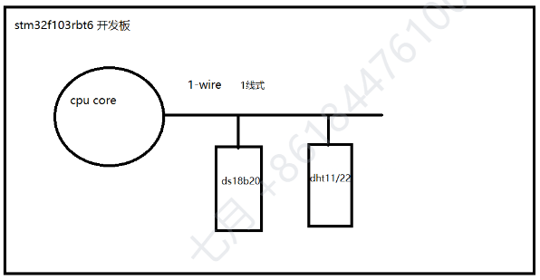

## dht11采集数据的格式

8b的湿度整数 + 8b的湿度小数 ＋ 8b的温度整数 ＋ 8b的温度小数 ＋ 8b校验位

一次40b数据

dht11采集不到温湿度的小数部分

## 掌握传输数据的时序

空闲状态：高电平

开始信号：先拉底再拉高

响应信号：先拉底再拉高

数据位：

​        0，先拉底50us再拉高26~28us

​        1，先拉底50us再拉高70us

停止信号：先拉低（DHT），再拉高（CPU）

cpu根据高电平持续时间长短的不同进行区分 ” 0 “ 和 ” 1 “ 

都是先拉底再拉高，那么拉高之后，延时50us后，再去读取数据线上的电平状态

50us后如果是 低电平 => 0

50us后如果是 高电平 => 1

# IIC总线

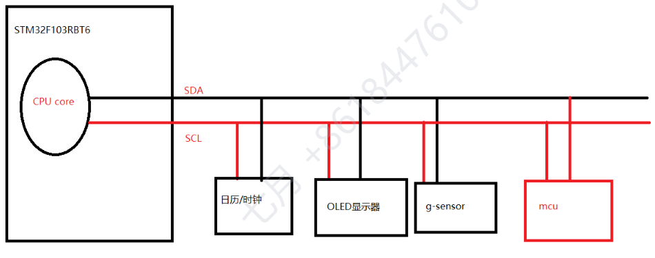

IIC是由飞利浦工司开发的，全称两线式串行同步总线

## 两线式：	 

​		SCL	时钟线（保证数据传输的同步性）

​		SDA	数据线（）

## 对比IIC总线和uart的区别：

uart硬件互联成本低，只有一根数据线

​		IIC除了数据线外，还需要时钟线来保证数据传输的同步性

uart是异步的，不需要应答机制，数据传输的时序更为简单

​		IIC是同步的，通信双方需要有应答机制

## IIC总线的特性：

发送方 

接收方

主设备：负责发送start信号和stop信号，产生时钟信号

从设备：每个从设备都有自己的设备地址，地址地址必须唯一的

同步	依赖时钟信号

支持总线仲裁：谁先发“1”，谁是主设备

## 特征：

- 1. IIC总线可以挂接多个IIC接口的设备
  2. 设备之间有主从之分，可以有多个主设备，支持总线仲裁
  3. 每个从设备都有自己独自的设备地址
  4. 传输的速率：

标准模式：100kb/s  100000b/s  115200

高速模式：400kb/s  

空闲状态：

SCL和SDA上均呈现高电平

空闲状态：

SCL和SDA上均呈现高电平

起始位：

在SCL处于高电平期间，SDA由高到底，产生一个下降沿

数据位：

高位先出，低送高取

在SCL时钟线处于低电平期间，发送方将数据放到数据线上

在SCL时钟线处于高电平期间，接受方将数据读走

8b

第一个字节是设备地址8b     7b的设备地址 + 读/写位

第9个周期	接收方一个ACK

第二个字节

第9个时钟周期	接收方回ACK

ACK：第9个时钟周期，由接收方发出		低电平

NACK：最后一个字节发送完毕的时候，由接收方发出	   高电平

结束位：

在SCL处于低电平期间，SDA由低到高，产生一个上升沿

### **主设备 给 从设备 发送数据（写从设备）：**

1.主设备发送起始位

2.主设备发送  7b设备地址 +  1b写位（0）

3.主设备发送8b的数据

4.主设备等待从设备发送ACK

5.第3，4步可以重复发送

6.当最后一个字节发送完毕，从设备回NACK

7.主设备发stop信号

### **主设备 从 从设备 读取数据**

1.主设备发送起始位

2.主设备发送  7b设备地址 + 1b读位(1)

3.主设备等待从设备发送ACK

4.从设备发送8b数据到数据线上

5.主设备在第9个时钟周期回ACK 

6.第4，5步可以重复发送

7.从设备发送完最后一个字节的数据，主设备回NACK

8.主设备发stop信号

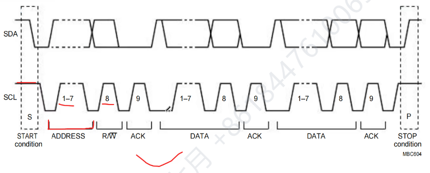

# 例题

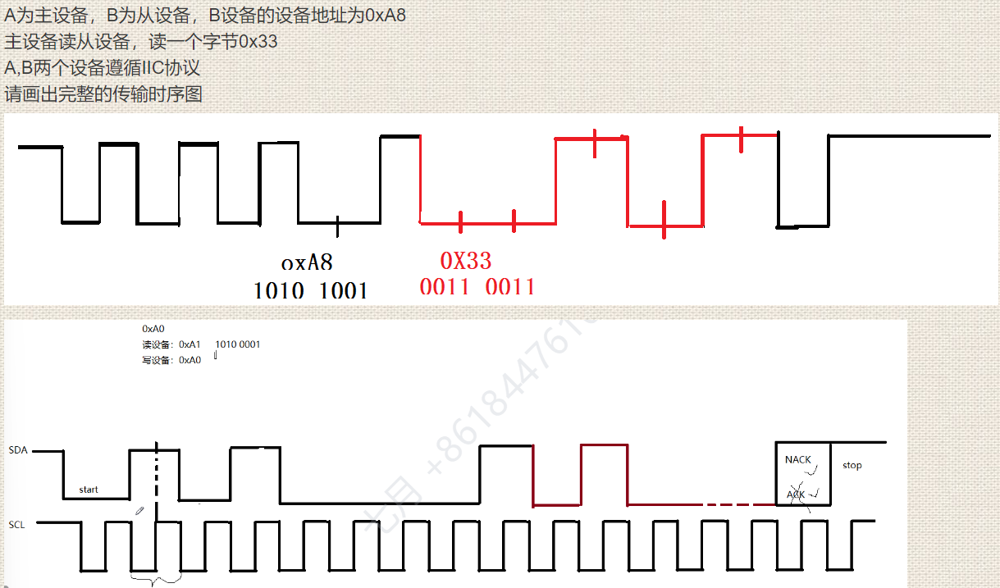

# 掌握各种ROM的电气特性

rom		掉电不丢失，只读存储器

prom	可编程的只读存储器	可一次编程（掩膜项目）

eprom	可一次擦除的可编程的只读存储器

eeprom	电可擦除的可编程只读存储器	按字节擦除

flash	电可擦除的可编程只读存储器	按块（多字节）擦除	128KB

mmc	可反复擦除的		MB

emmc	电可反复擦除的存储器

# eeprom是IIC接口的设备

有些IIC接口的设备天生就只能是从设备

比如：eeprom		

eeprom是两线式串行接口设备

容量：1K  2K		8B一页

4K  8K  16K		16B一页

半双工模式  数据线只有一根

通过手册了解eeprom的时序：

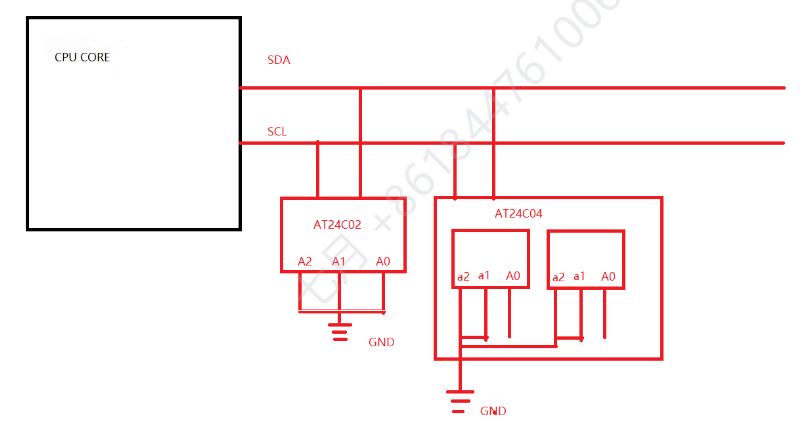

# 掌握eeprom的读写时序

## 写时序：

### 按字节写：

1）cpu发出start信号

2）cpu发送7位设备地址 + 1b写位 ‘0’	IIC_Send_byte

3）等待eeprom发来的ACK信号	IIC_WAIT_ack  =>  0

4）发送内部存储空间的地址：0x00 ~ 0xFF	IIC_Send_byte

5）等待eeprio发来的ACK信号

6)cpu向内部存储空间写入1个字节的数据

7）等待eeprio发来的ACK信号

8）cpu产生stop信号

### 按页写：

1）cpu发出start信号

2）cpu发送7位设备地址 + 1b写位 ‘0’	IIC_Send_byte

3）等待eeprom发来的ACK信号	IIC_WAIT_ack  =>  0

4）发送内部存储空间的地址：0x00 ~ 0xFF	IIC_Send_byte

5）等待eeprio发来的ACK信号

6)cpu向内部存储空间写入1个字节的数据

7）等待eeprio发来的ACK信号

8）第6，7两步可以重复

9）cpu产生stop信号

## 读时序：

当前地址读：

1）cpu发出start信号

2）cpu发送7位设备地址 + 1b读位 ‘1’

3）等待eeprom发来的ACK信号	IIC_WAIT_ack  =>  0

4）cpu接收eeprom发来的1个字节

5）cpu发送NACK

6）cpu产生stop信号

### 随机地址读：

注意：随机地址读，先是假写的过程，

（假写的目的是为了确定将来从内部存储空间的哪个地址开始读）

1）cpu发出start信号

2）cpu发送7位设备地址 + 1b写位 ‘1’

3）等待eeprom发来的ACK信号	IIC_WAIT_ack  =>  0

4）cpu发送内部存储空间的地址

5）等待eeprom发来的ACK信号

6）cpu发送start信号

7）cpu发送7b设备地址+1b读位1

8）等待eeprom发来的ACK信号

9）cpu接收eeprom发来的1个字节

10）cpu产生NACK

11）cpu产生stop信号

### 顺序地址读

注意：顺序地址读的初始化序列，是从‘当前地址读“或”随机地制读“之间二选一

唯一不同的是，可以读多个字节。 

# sht30

工业级温湿度传感器

## sht30采集数据的格式

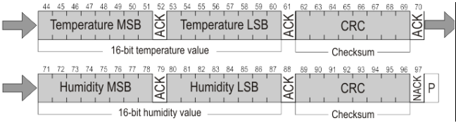

8b的温度高位 + 8b温度低位 + 8b CRC（校验值）

8b的湿度高位 + 8b湿度低位 + 8b CRC（校验值）

## 熟悉sht30通信时序

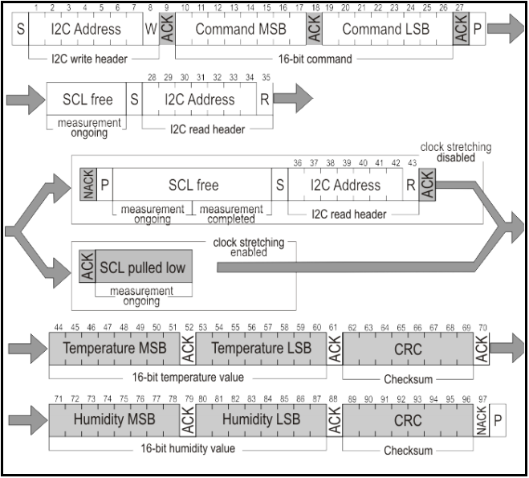

1）发送start信号

2）发送7b的设备地址 + w

3）等待sht30发送ack信号

4）发送8b MSB command  => 设置采样频率

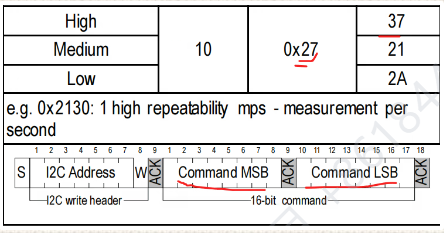

5）等待sht30发送ack信号

6）发送8b LSB command  => 设置采样频率

7）等待sht30发送ack信号

8）发送stop信号

9）SCL  free 时钟线释放

10）发送start信号

11）发送7b的设备地址 + w

12）等待sht30发送ack信号

13）读取数据  每读取8b数据，都等待ACK信号

14）主设备发送NACK

15）主设备发stop信号

注意：将来取数据的时候需要发送16b的取数据命令 0xE000

  将来采集到的数据需要经过公式的转换

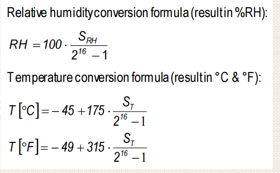

## 采集数据的频率：

cpu在第一个时钟周期先向sht30发送采样频率的命令

mps（每秒钟采样次数）